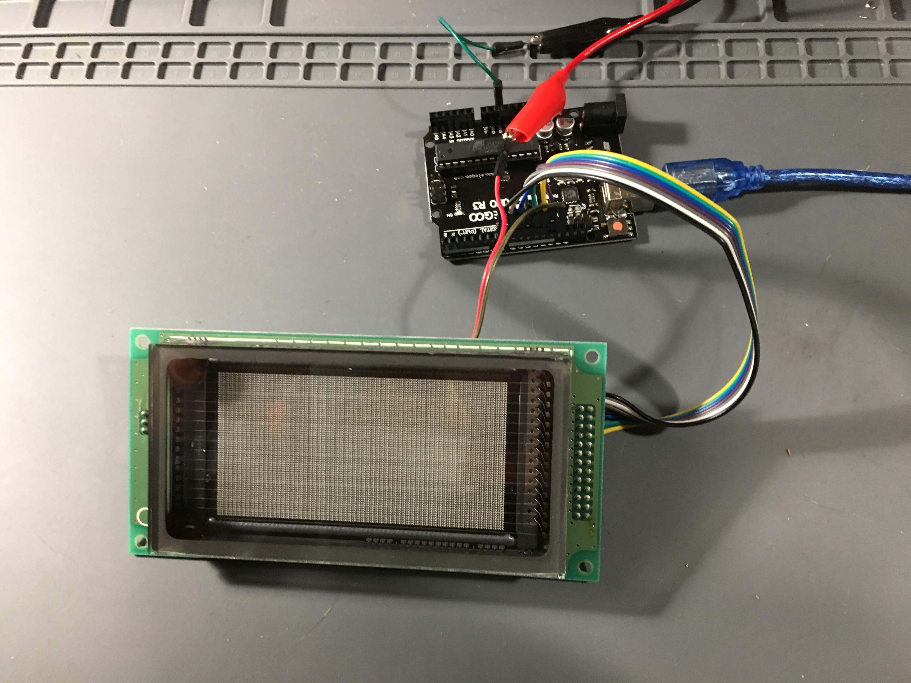
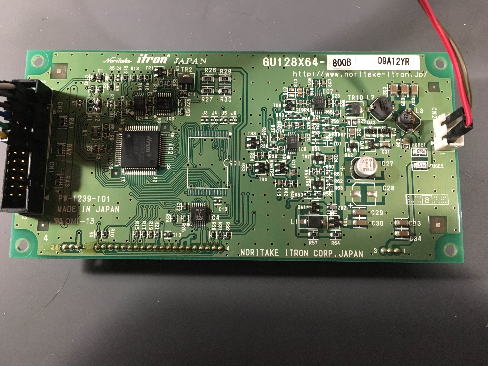
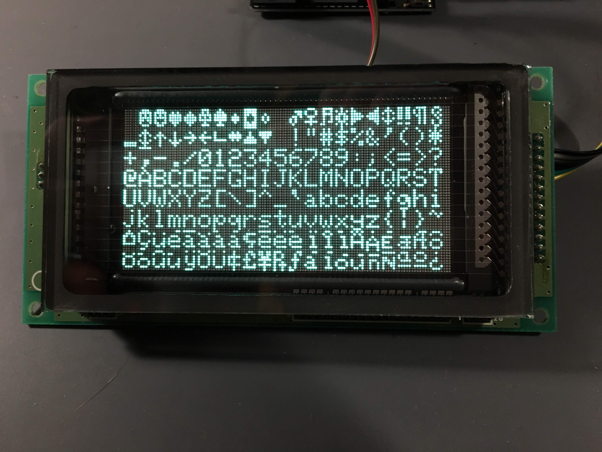

# Arduino library for Noritake GU800-series graphical VFDs

This library provides an Adafruit_GFX drawing interface for use with Noritake
GU800-series graphical vacuum-fluorescent displays, as well as exposing the
display's native command set.

While I have only tested this library using a GU128X64-800B display, the
datasheets of other GU800-series displays suggest that it should be possible to
adapt this library to work with other similar models by changing the
`GU800_WIDTH` and `GU800_HEIGHT` macros as appropriate.

Since the GU800 provides no means to read the contents of its framebuffer, and
it is only possible to write whole bytes, rather than manipulate individual
pixels, this library draws to a 1kbyte framebuffer on the Arduino, and transfers
it to the display when the `display()` method is called (similar to the
ubiquitous I2C SSD1306 displays).

## Datasheet Links

GU128X64-800B: https://media.digikey.com/pdf/Data%20Sheets/Noritake%20PDFs/GU128X64-800B.pdf

## Notes

### Power

Power supply is 5VDC (higher-voltage DC for the anode and grid, and AC for the
filament, are produced by an onboard converter). Rated max. current is 900mA, on
my unit I observed ~500mA idle current with no pixels lit, ~650mA with all
pixels lit. This is too high to power over USB, but *just barely* within the
allowable limits of the Arduino's onboard 5v regulator, so it may be possible to
power from an Arduino connected to an external PSU.

Input voltage tolerance is rather narrow; a sag to 4.7v is enough to cause the
display to reset. Rated long-term max. input voltage is 5.2v, absolute max. is
6.5v.

Output levels are 5V TTL, input thresholds not suitable for 3.3v.

### Connectors

Jumpers J1 and J2 set the interface type:

| J1     | J2     | Type                    |
|--------|--------|-------------------------|
| Open   | Open   | 8080 parallel (default) |
| Closed | Open   | 6800 parallel           |
| Any    | Closed | SPI                     |

The power connector is 3 pin JST B3B-XH-A.

| Pin | Description |
|-----|-------------|
| 1   | 5V DC       |
| 2   | Test        |
| 3   | GND         |

Grounding the test pin illuminates all pixels on the display.

The data connector is a standard 2x13 0.1" header, with keyed shroud. Even numbered
pins (except 26 which is /RESET) are grounds. Assignments for the other pins
depend on the interface type set by J1 and J2 - refer to the datasheet for full
descriptions.

### Signals

In addition to the interface-specific signals, the following signals are used:

| Name   | Description                                                            |
|--------|------------------------------------------------------------------------|
| /CS    | Chip-select. Active-low.                                               |
| C/D    | Command/Data select. Set high to write command, set low to write data. |
| /RESET | Reset display. Active-low. Must be held low for > 1.5ms.               |
| FRP    | "Frame pulse". Driven high while display is being refreshed.           |

### SPI Interfacing

Data is transferred over SPI MSB-first, using mode 3 (clock idles high, data
valid on rising clock), with a maximum clock rate of 5 MHz. /CS must be
deasserted after every byte transferred.

/CS must be asserted at least 40 ns before starting the clock, and must remain
asserted at least 150ns after the last clock pulse. C/D is sampled on the last
clock pulse and must be held until C/D is deasserted.

Note that I experienced instability at higher SPI speeds with the display
connected via a breadboard. Connect the display directly for best results, or
reduce the SPI clock rate in `GU800_GFX.h`.

### Buffer format

Data is written to the GU800 as bytes, with each byte representing a column of
eight pixels, LSB at the top. The framebuffer maintained in this library follows
this format, in row-major order (8x 8-pixel-tall rows of 128 columns each).

### Refresh Rate / Sync

The display refreshes at ~140 Hz, and outputs the FRP signal as a kind of
'vertical blank' signal. According to the datasheet, the optimal time window to
write to the active page, or flip pages, is within 6ms of FRP going low.

In practice, animation seems to be smooth enough without caring about sync
pulses, but it might be worth looking into.

## Constructor

### SPI

`GU800(int csPin, int dcPin, int resetPin)`

* `csPin`: pin connected to /CS
* `dcPin`: pin connected to D/C
* `resetPin`: (optional) pin connected to /RESET

### Parallel

TODO

## API

As well as the standards `Adafruit_GFX` drawing primitives, the following
methods are exposed:

* `begin()` - Reset and initialize display. Must be called before use.
* `display()` - send the Arduino framebuffer to the display. Must be called
  after drawing operations in order to show the result.
* `clearDisplay(bool display=false)` - Clear framebuffer. If `display` is true,
  also blank the display.
* `invertDisplay(bool invert)` - enable or disable reverse-video mode.
* `dim(uint8_t level)` - Set display brightness; 0=minimum, 16=maximum.
* `displayOn(bool fade)` / `displayOff(bool fade)` - turn display on and off. If
  `fade` is true, use a fade-in/out effect. Display contents are
  preserved.

The full command set is available as public methods, but should be used with
care since they could put the display into a state not expected by the library.

## Action Shots

Front view of board; connected to an Arduino.

Back of board. Note that J2 (near the black connector) is bridged, to configure SPI mode.

## To Do

* Support for software SPI
* Support for parallel interface
* Option to wait for sync pulse in `display()` call, for smoother animation